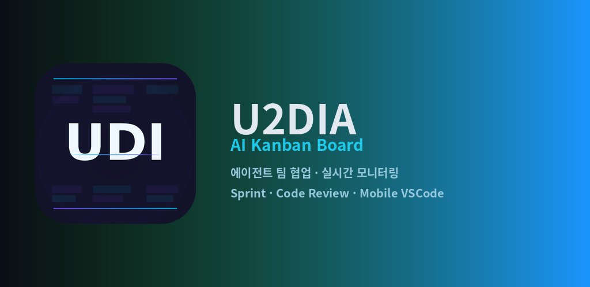
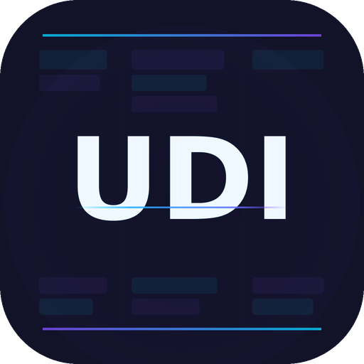

# U2DIA AI Kanban Board

> AI 에이전트 팀의 병렬 개발을 실시간으로 모니터링하는 멀티 에이전트 협업 칸반 플랫폼.

<p align="center">
  
</p>

<p align="center">
  
</p>

[](LICENSE)


---

## ✨ 무엇을 하는가

Claude Code · Cursor · Codex 같은 AI 코딩 에이전트들이 병렬로 일할 때, **누가 뭘 하고 있는지 한눈에 보고**, **체계적으로 협업하게** 만드는 칸반 서버입니다.

### 핵심 기능
- **실시간 칸반보드** — 팀 단위 보드, 티켓 라이프사이클(Backlog→InProgress→Review→Done), SSE 실시간 푸시
- **멀티 에이전트 협업** — 프로젝트별 전문 에이전트 스폰, 역할 기반 자동 분배, 의존성 그래프
- **Sprint 관리** (gstack 패턴) — 7단계 워크플로우, 5가지 품질 게이트, 번다운/벨로시티
- **Supervisor QA** — Ollama 로컬 LLM 자동 검수, 점수 미달 시 재작업 자동 발행
- **Remote CLI Mirror** — 모바일에서 PC 터미널(tmux) 실시간 미러링
- **Mobile VSCode Workspace** — 폰/태블릿에서 풀 편집 가능한 VSCode (code-server)
- **MCP (Model Context Protocol)** — Claude Code 등 27개 도구 직접 호출
- **Cross-Model Code Review** — Claude · Gemini · Ollama 다중 모델 합의 리뷰
- **Agent Office (픽셀 시뮬레이션)** — 캐릭터 스프라이트로 에이전트 작업 상태 가시화

### 스크린샷
앱 화면 미리보기는 **Google Play Store** 페이지에서 확인하세요 (다양한 기기 비율 등록).
- 폰 스크린샷 5장 · 7인치/10인치 태블릿 각 5장
- 메인 화면, 팀 칸반보드, Sprint 관리, 활동 히스토리, 아카이브

---

## 🚀 빠른 시작

### 서버
```bash
git clone https://github.com/U2SY26/u2dia-kanban.git
cd u2dia-kanban
pip install -r requirements.txt   # 선택 — server.py 자체는 표준 라이브러리만 사용
python3 server.py                 # 기본 포트 5555
```

브라우저에서 http://localhost:5555/ 접속.

### 모바일 앱 (Android)
GitHub Releases에서 최신 AAB 다운로드 → 설치 → 서버 URL 입력.

> ⚠️ **AAB 설치 시 VPN 권장**. 자세한 보안 가이드는 아래 [보안](#-보안--vpn-필수) 섹션 필독.

### Flutter 빌드 (개발자)
```bash
cd flutter_app
flutter pub get
flutter build appbundle --release
```

### 데스크톱 앱 (Electron)
```bash
cd desktop/server-manager-app && npm install && npm start
cd desktop/frontend && npm install && npm start
```

---

## 🔐 보안 — VPN 필수

**이 서버는 외부 인터넷에 직접 노출하지 마세요.**

`server.py`는 단일 사용자/팀 내부용으로 설계되었으며 인증은 라이선스 토큰 기반입니다. 외부 노출 시 **반드시 VPN 또는 Tailscale 같은 오버레이 네트워크 사용**을 권장합니다.

### 권장 구성

| 환경 | 바인드 | 외부 접근 |
|------|--------|---------|
| 로컬만 | `127.0.0.1:5555` | ❌ 차단 |
| LAN | `192.168.x.x:5555` | LAN 내부만 |
| 원격 (모바일에서 접근) | `127.0.0.1:5555` | **Tailscale / WireGuard / Cloudflare Tunnel** |

### Tailscale 예시 (가장 쉬움)
1. PC와 모바일 모두 [Tailscale](https://tailscale.com) 설치 (무료)
2. PC: `python3 server.py` (기본 127.0.0.1)
3. 모바일 앱에 PC의 Tailscale IP(`100.x.x.x:5555`) 입력 — 끝.

암호화 + ZeroTrust + ACL이 기본 적용됩니다.

### ❌ 절대 금지
- `0.0.0.0` 바인드로 외부 직접 노출 (`scripts/cli-mirror-up.sh`도 이를 강제 차단)
- `service-account.json`, `.env`, DB 파일을 git에 커밋
- 동일 토큰을 여러 프로젝트에서 재사용

### 환경변수
| 변수 | 용도 | 기본 |
|------|------|------|
| `KANBAN_DB_PATH` | SQLite DB 경로 | `./agent_teams.db` |
| `OPENAI_API_KEY` | OpenAI 연동 (선택) | - |
| `ANTHROPIC_API_KEY` | Claude API (선택) | - |
| `CLI_PROXY_REMOTE_OK` | CLI Mirror 외부 허용 | `0` (차단) |
| `VSCODE_PROXY_REMOTE_OK` | VSCode 워크스페이스 외부 허용 | `0` (차단) |
| `GOOGLE_APPLICATION_CREDENTIALS` | Play Store API용 service account | - |

---

## 📦 모바일 앱 (AAB) 직접 설치

GitHub Releases 페이지에서 최신 `app-release.aab` 다운로드:

```
https://github.com/U2SY26/u2dia-kanban/releases/latest
```

### Android 설치 방법

AAB는 Play Store가 아닌 직접 설치 시 [bundletool](https://github.com/google/bundletool) 로 APK 변환 후 설치합니다.

```bash
# 1. bundletool 다운로드
wget https://github.com/google/bundletool/releases/latest/download/bundletool-all.jar

# 2. APK 세트 생성 (디버그 키 사용)
java -jar bundletool-all.jar build-apks \
  --bundle=app-release.aab \
  --output=app.apks \
  --mode=universal

# 3. 추출 및 설치
unzip app.apks -d app-apks
adb install app-apks/universal.apk
```

또는 **Google Play Store 정식 출시 버전**: 검색 → "U2DIA AI Kanban" (출시 후 링크 추가).

### 모바일에서 PC 서버 접근 — VPN 필수

위 [보안](#-보안--vpn-필수) 섹션의 Tailscale 가이드를 그대로 따르세요. VPN 없이 외부 IP 직접 접근은 **공격 표면을 크게 넓히므로 권장하지 않습니다.**

---

## 🏗️ 아키텍처

```
서버 (Python 표준 라이브러리만)
├── server.py              단일 파일, SQLite WAL, SSE 실시간 푸시, MCP/REST API
├── web/                   Vanilla JS/CSS SPA (외부 CDN 0)
└── scripts/               cli-mirror, code-server, play-publisher 등

데스크톱 (Electron)
├── desktop/server-manager-app/   서버 관리, 토큰 CRUD, 메트릭
├── desktop/frontend/             칸반보드 뷰어
└── desktop/shared/               공유 모듈

모바일 (Flutter)
└── flutter_app/lib/screens/      kanban, agent_office, vscode, cli, dashboard, ...
```

상세는 [docs/](docs/) 참조.

---

## 🤖 MCP 통합

Claude Code 등 MCP 클라이언트의 `.claude/settings.json`:

```json
{
  "mcpServers": {
    "kanban": {
      "type": "url",
      "url": "http://localhost:5555/mcp",
      "headers": {
        "Authorization": "Bearer YOUR-TOKEN-HERE"
      }
    }
  }
}
```

토큰 발급은 서버의 `/admin/tokens` 페이지 또는 `POST /api/tokens` API.

---

## 📚 문서

- [docs/UNIVERSAL_AGENT_RULES.md](docs/UNIVERSAL_AGENT_RULES.md) — 에이전트 헌법 (필독)
- [docs/MCP_AGENT_GUIDE.md](docs/MCP_AGENT_GUIDE.md) — MCP 에이전트 가이드
- [docs/MCP_SETUP_GUIDE.md](docs/MCP_SETUP_GUIDE.md) — MCP 설정
- [docs/REMOTE_ACCESS_GUIDE.md](docs/REMOTE_ACCESS_GUIDE.md) — 원격 접근 가이드
- [docs/ROADMAP.md](docs/ROADMAP.md) — 로드맵

---

## 🤝 기여

PR 환영합니다. [CONTRIBUTING.md](CONTRIBUTING.md) 참조.

---

## 📜 라이선스

[MIT License](LICENSE) © 2026 U2DIA

문의: u2dia@naver.com · [www.u2dia.com](https://www.u2dia.com)
