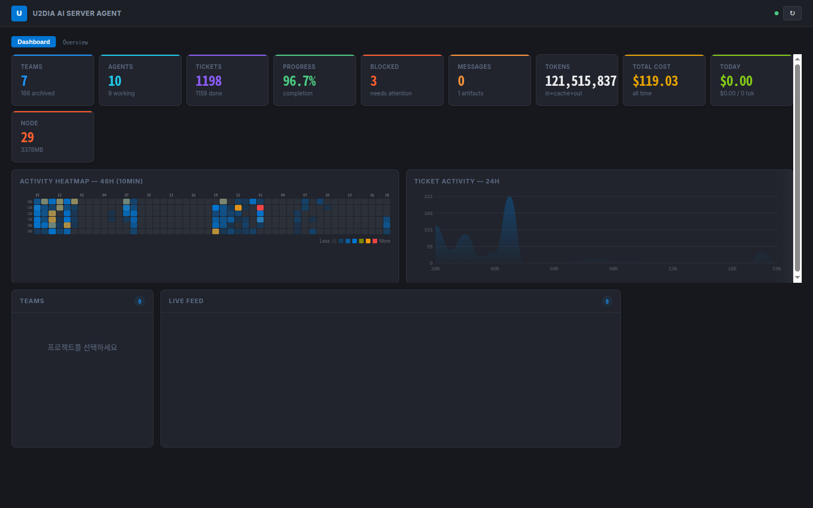

<p align="center">
  
</p>

<h1 align="center">U2DIA AI Kanban Board</h1>

<p align="center">
  <strong>The open-source kanban board for Claude Code agent teams.</strong><br/>
  Zero dependencies. MCP native. Real-time monitoring.
</p>

<p align="center">
  <a href="LICENSE"></a>
  
  
  
  
</p>

<p align="center">
  <a href="#quick-start">Quick Start</a> · <a href="#mcp-integration">MCP Integration</a> · <a href="#features">Features</a> · <a href="#downloads">Downloads</a> · <a href="#documentation">Docs</a> · <a href="#contributing">Contributing</a> · <a href="#sponsor">Sponsor</a>
</p>

---

<p align="center">
  
</p>

---

## What is this?

**U2DIA Kanban Board** is a real-time monitoring and management tool for Claude Code agent teams running in parallel. Connect from **any project** via MCP — create teams, assign tickets, track agent work, and see everything happen live.

```
Your Project ──MCP──→ Kanban Board ──→ Real-time Dashboard
                                   ──→ Live Feed (SSE)
                                   ──→ Android App
                                   ──→ Desktop App
```

**One command. No pip install. No npm install. Just run it.**

```bash
python3 server.py
```

## Why U2DIA?

| | |
|---|---|
| **Zero Dependencies** | Pure Python standard library — nothing to install, ever |
| **Single File Server** | HTTP + MCP + SSE + SQLite + REST API in one `server.py` |
| **MCP Native** | 27+ tools for Claude Code agent orchestration |
| **Real-time** | SSE-powered live feed, heatmap, KPI dashboard |
| **Multi-Platform** | Web SPA + Android APK + Electron Desktop |
| **Sprint System** | gstack-inspired 7-phase workflow (Think→Ship) |
| **Quality Gates** | 5 gate types + Nemotron/Ollama auto-review |
| **Legal Compliance** | GDPR, privacy, security, license audit checklist |
| **Constitution Model** | Minimal rules, maximum agent autonomy |

## Quick Start

### 1. Run the server

```bash
git clone https://github.com/U2SY26/u2dia-kanban.git
cd u2dia-kanban
python3 server.py
```

Open **http://localhost:5555** — that's it.

### 2. Connect from any project

Add to your project's `.claude/settings.json`:

```json
{
  "mcpServers": {
    "kanban": {
      "type": "url",
      "url": "http://localhost:5555/mcp"
    }
  }
}
```

Now your Claude Code agents can use 27+ kanban tools automatically.

## MCP Integration

### Available Tools (27+)

| Tool | Purpose |
|------|---------|
| `kanban_team_list` / `kanban_team_create` | Team management |
| `kanban_board_get` / `kanban_team_stats` | Board & statistics |
| `kanban_member_spawn` | Spawn agents |
| `kanban_ticket_create` / `kanban_ticket_claim` / `kanban_ticket_status` | Ticket lifecycle |
| `kanban_message_create` / `kanban_message_list` | Agent communication |
| `kanban_artifact_create` / `kanban_artifact_list` | Artifact sharing |
| `kanban_activity_log` | Activity logging |
| `kanban_auto_scaffold` | Auto-scan project structure |
| `kanban_feedback_create` / `kanban_feedback_list` / `kanban_feedback_summary` | QA & feedback |
| `kanban_supervisor_review` / `kanban_supervisor_stats` | Ollama/Nemotron auto QA |
| `kanban_sprint_create` / `kanban_sprint_phase` / `kanban_sprint_gate` | Sprint management |
| `kanban_sprint_metrics` / `kanban_sprint_velocity` / `kanban_sprint_burndown` | Metrics & charts |
| `kanban_sprint_cross_review` / `kanban_sprint_retro` | Cross-model review & retro |

### Agent Workflow

```
1. Create team     → kanban_team_create
2. Create tickets  → kanban_ticket_create (decompose before coding)
3. Spawn agents    → kanban_member_spawn
4. Work            → ticket_claim → activity_log → ticket_status
5. Deliver         → artifact_create → feedback → Done
```

## Features

### Web Dashboard
- **KPI Grid** — Teams, agents, tickets, progress, costs — all live
- **48h Heatmap** — Activity visualization at 10-min granularity
- **Live Feed** — SSE real-time events with smooth animations
- **Kanban Board** — 6-column board with drag & drop
- **Project Grouping** — Drill-up/down views per project
- **JSON Export** — Download current state as structured data

### Android App
- **Dashboard** — KPI, heatmap, team overview
- **Live Feed** — SSE streaming with filters
- **Kanban Board** — Full ticket management
- **AI Chat (유디)** — Talk to resident AI agent
- **History & Archives** — Detailed timelines, tabbed detail views
- **System Monitor** — CPU, memory, disk, connected clients

### Desktop App (Electron)
- **Server Manager** — Start/stop server, manage auth tokens
- **System Tray** — Background operation with notifications
- **Client Monitor** — Connected MCP clients overview

## Downloads

| Platform | Download |
|----------|----------|
| **Android APK** | [Latest Release](https://github.com/U2SY26/U2DIA-KANBAN-BOARD/releases/latest) |
| **Linux AppImage** | [Latest Release](https://github.com/U2SY26/U2DIA-KANBAN-BOARD/releases/latest) |
| **Windows** | [Latest Release](https://github.com/U2SY26/U2DIA-KANBAN-BOARD/releases/latest) |
| **Web** | `python3 server.py` → http://localhost:5555 |

## Architecture

```
U2DIA-KANBAN-BOARD/
├── server.py              # Single-file Python server (stdlib only)
│                          # HTTP + MCP + SSE + SQLite + REST API
├── web/                   # Static SPA frontend (vanilla JS/CSS)
│   ├── index.html         # App shell
│   ├── css/               # Design system (Salesforce Lightning Dark)
│   └── js/                # Modules (dashboard, kanban, sse, api, sidebar, cli)
├── flutter_app/           # Android mobile app
│   └── lib/
│       ├── screens/       # Dashboard, Feed, Kanban, Chat, History, Archives
│       └── services/      # API, SSE, Auth, Notifications
├── desktop/               # Electron desktop apps
│   ├── server-manager-app/# Server Manager (control, tokens, metrics)
│   └── frontend/          # Frontend Viewer
└── docs/                  # Documentation
```

### Tech Stack

| Layer | Technology | Why |
|-------|-----------|-----|
| **Server** | Python 3.8+ (stdlib only) | Zero dependencies, runs anywhere |
| **Database** | SQLite (WAL mode) | Concurrent access, no setup |
| **Real-time** | SSE (Server-Sent Events) | Lightweight, HTTP-native |
| **Web** | Vanilla JS/CSS | No build tools, no bundlers |
| **Mobile** | Flutter/Dart | Cross-platform, native performance |
| **Desktop** | Electron | Windows/Linux/macOS |

## URLs

| URL | Purpose |
|-----|---------|
| `http://localhost:5555/` | Dashboard (SPA) |
| `http://localhost:5555/#/board/{teamId}` | Team Kanban Board |
| `http://localhost:5555/#/archives` | Archives |
| `http://localhost:5555/api/...` | REST API |
| `http://localhost:5555/mcp` | MCP endpoint (JSON-RPC 2.0) |

## Documentation

- [MCP Setup Guide](docs/MCP_SETUP_GUIDE.md) — Connect from other projects
- [Agent Guide](docs/MCP_AGENT_GUIDE.md) — For agent consumption
- [Team Operations](docs/agent_teams_규정.md) — Team governance principles
- [Agent Constitution](docs/UNIVERSAL_AGENT_RULES.md) — Immutable principles
- [Roadmap](docs/ROADMAP.md) — Future plans

## Contributing

We welcome contributions! See [CONTRIBUTING.md](CONTRIBUTING.md) for guidelines.

```bash
# Development
python3 server.py              # Server (no dependencies)
cd flutter_app && flutter run  # Mobile app
cd desktop/server-manager-app && npm start  # Desktop app
```

## Sponsor

<p align="center">
  <strong>U2DIA Kanban Board is free and open-source, made possible by U2DIA.</strong>
</p>

If this project saves you time or helps your team work better with Claude Code, consider supporting its development:

<p align="center">
  <a href="https://github.com/sponsors/U2SY26"></a>
</p>

Your sponsorship helps us:
- Maintain and improve the kanban board
- Add new features and platform support
- Keep it free and open-source for everyone

---

### About U2DIA

<table>
<tr>
<td width="120" align="center">
  <a href="https://www.u2dia.com"><strong>U2DIA</strong></a>
</td>
<td>
  <strong>AI Data Platform for Manufacturing</strong><br/>
  U2DIA integrates and structures dispersed manufacturing data into actionable insights. Our flagship product <strong>LINKO</strong> unifies PLM, APS, MES, and CAM — reducing CAM work time by up to 80% through PMI-based automation.<br/><br/>
  <strong>U2DIA AI</strong> connects 13+ CAD/CAM systems through an intelligent engine with 97% answer accuracy. <strong>U2DIA COMMERCE AI</strong> integrates 5,000+ marketplaces with AI-powered dynamic pricing.<br/><br/>
  🏢 <a href="https://www.u2dia.com">www.u2dia.com</a> · 📧 u2dia@naver.com · 📸 <a href="https://instagram.com/u2dia_official">@u2dia_official</a><br/>
  🏅 <strong>NVIDIA Inception Program</strong> Member
</td>
</tr>
</table>

---

<p align="center">
  <sub>Made with ❤️ by <a href="https://www.u2dia.com">U2DIA</a> · MIT License · <a href="https://github.com/U2SY26/U2DIA-KANBAN-BOARD">Star ⭐ if this helps you!</a></sub>
</p>

---

<details>
<summary><strong>🇰🇷 한국어</strong></summary>

## U2DIA AI 칸반보드

Claude Code 에이전트 팀의 병렬 개발을 실시간 모니터링하는 엔터프라이즈급 칸반보드.

### 빠른 시작

```bash
git clone https://github.com/U2SY26/u2dia-kanban.git
cd u2dia-kanban
python3 server.py
# http://localhost:5555 접속
```

### MCP 연결

프로젝트의 `.claude/settings.json`에 추가:
```json
{
  "mcpServers": {
    "kanban": {
      "type": "url",
      "url": "http://localhost:5555/mcp"
    }
  }
}
```

### 주요 기능
- **웹 대시보드** — KPI, 히트맵, 실시간 피드, 칸반보드
- **Android 앱** — 대시보드, 피드, 칸반, AI 채팅, 히스토리
- **데스크톱 앱** — 서버 관리, 토큰 관리, 시스템 모니터링
- **MCP 도구 17개** — 팀/티켓/에이전트/산출물/피드백 관리

### U2DIA 소개
U2DIA는 제조업 AI 데이터 플랫폼 기업입니다. LINKO(제조관리), U2DIA AI(CAD/CAM 통합), U2DIA COMMERCE AI(이커머스) 등을 운영하며, NVIDIA Inception Program 멤버입니다.

🏢 [www.u2dia.com](https://www.u2dia.com) · 📧 u2dia@naver.com

</details>
